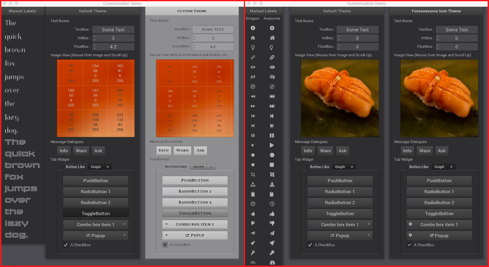

# nanogui-customization-demo

Tutorial repository for customizing the [NanoGUI][nanogui] theme, and embedding custom
fonts and icon fonts.



On the left is the `example_customization` executable, it demonstrates how to both
change the default colors and icons, as well as how to set a user-specified default
font.  On the right is the `example_custom_icon_font` executable, it demonstrates how
to load an entirely different icon font and use it as the default for NanoGUI widgets.

**Contents**

- [Getting Started](#getting-started)
    - [Building this Project Locally](#building-this-project-locally)
        - [Running the Customized Examples](#running-the-customized-examples)
    - [Configuring a Git Submodule](#configuring-a-git-submodule)
- [Customizing the NanoGUI Theme Class](#customizing-the-nanogui-theme-class)
    - [Changing the Colors](#changing-the-colors)
    - [Changing the Default Icons](#changing-the-default-icons)
    - [Using the Customized Theme](#using-the-customized-theme)
- [Custom Fonts](#custom-fonts)
    - [Embedding Custom Font Faces with NanoGUI](#embedding-custom-font-faces-with-nanogui)
        - [Choose Some Custom Fonts](#choose-some-custom-fonts)
        - [Inform NanoGUI of Custom Fonts](#inform-nanogui-of-custom-fonts)
        - [Use the Custom Fonts](#use-the-custom-fonts)
    - [Embedding Custom Icon Fonts with NanoGUI](#embedding-custom-icon-fonts-with-nanogui)
        - [Generating a Custom Icon Font](#generating-a-custom-icon-font)
        - [Inform NanoGUI of Custom Icon Fonts](#inform-nanogui-of-custom-icon-fonts)
    - [VERY Important Consideration for all Custom Fonts](#very-important-consideration-for-all-custom-fonts)
- [License](#license)

# Getting Started

## Building this Project Locally

To run the example customizations found in this repository, first clone and build from
source:

```console
$ git clone --recursive https://github.com/svenevs/nanogui-customization-demo.git
$ cd nanogui-customization-demo/
$ mkdir build
$ cd build
```

### Linux / OSX

Generate a `Makefile` and build in parallel (`-j 4` says use four cores, you may also
run `make -j` to use all available cores).

```console
$ cmake ..
$ make -j 4
```

### Windows

Typically you will want to generate a Visual Studio project, making sure to generate a
64 bit project (the default is 32).  Run `cmake -G` to see the available generators, an
example for generating a Visual Studio 2015 64 bit build may look like

```console
$ cmake -G "Visual Studio 14 2015 Win64" ..
```

You can then either launch the visual studio project (`.sln` file), or run

```console
$ cmake --build . --config Release
```

### Running the Customized Examples

In this project's [`CMakeLists.txt`](CMakeLists.txt), the variable

```cmake
set(CMAKE_RUNTIME_OUTPUT_DIRECTORY "${CMAKE_CURRENT_BINARY_DIR}/bin")
```

means that the compiled executables are all placed in a `bin/` subdirectory:

```console
$ ls -1 bin/
example1
example2
example3
example4
example_custom_icon_font
example_customization
example_fontawesome
example_icons
```

Examples 1, 2, 3, 4, and `example_icons` all come from NanoGUI.  The other three come
from this project.  The reason for bringing this to your attention is that `example1`,
`example_customization`, and `example_custom_icon_font` all rely on a specific
_runtime directory_ when running the application (some icon images are loaded).

Simply make sure that you run the executables from the `build/` directory:

```console
$ ./bin/example_customization
$ ./bin/example_custom_icon_font
```

That is, do **not** `cd bin` and run `./bin/example_customization` (the icons will not
be found because the path to the loaded images is hard-coded).

Similarly, the python executables all get copied for you.  From the `build/` directory,
there should also be a `python` directory:

```console
$ ls python/
custom_screen.py               example2.py                    example_custom_icon_font.py    example_icons.py
custom_theme.py                example3.py                    example_customization.py       example_typicons.py
example1.py                    example4.py                    example_fontawesome.py         nanogui.cpython-36m-darwin.so*
```

In this case, the python bindings were built with my local Python 3.6 (`36m`).  Without
installing the python library and/or modifying `PYTHONPATH`, in order to be able to
`import nanogui` you need to run the python examples from the **same** directory:

```console
$ cd python
$ python3 example_customization.py
```

## Configuring a Git Submodule

> **NOTE**: currently, the submodule here points to a *fork* of NanoGUI.  The branch
> being used here will be **deleted** if / when this is merged into the upstream.
> Currently the branch being used is
> [`svenevs/custom_fonts`](https://github.com/svenevs/nanogui/tree/custom_fonts).  This
> repository will be updated if / when this is merged into the upstream, **but** the
> directions that follow are written as if this merge has already occurred!

This section outlines how to get a [`git submodule`][submodule] setup if you do not know
how.  If you do, skip ahead to the
[Customizing the NanoGUI Theme Class](#customizing-the-nanogui-theme-class) section.

[NanoGUI][nanogui] is designed to be built as a [`git submodule`][submodule],
guaranteeing that your GUI toolkit can always be built regardless of what a user of your
repository may or may not already have installed.  We will first create the following
directory structure in an existing `git` repository:

```
some_repo/
    CMakeLists.txt  # <- The parent project build system.
    ext/
        nanogui/    # <- The nanogui git submodule.
    resources/
        # Where we will store our custom fonts.
```

So assuming you are in the root directory `some_repo`:

```console
$ mkdir ext
$ cd ext
$ git submodule add https://github.com/wjakob/nanogui.git
```

What this does is inform `git` that there is a sub-project that needs to be cloned as
well, it will create a file `.gitmodules` representing this fact.  Since NanoGUI also
has submodules, when we set this up **the first time**, these have **not** been cloned.

```console
$ git submodule update --init --recursive
```

Once you run that command, all of the submodules of NanoGUI will now be downloaded.  In
the future, put instructions in your README informing users to clone your repository
recursively:

```console
$ git clone --recursive https://github.com/username/repository.git
```

[submodule]: https://git-scm.com/book/en/v2/Git-Tools-Submodules

# Customizing the NanoGUI Theme Class

Customizing the NanoGUI Theme class is straight-forward if all you want to do is change
the default colors, or possibly some of the default icons.

### Changing the Colors

Create a derived type of `nanogui::Theme`, refer to the
[Theme documentation](http://nanogui.readthedocs.io/en/latest/api/class_nanogui__Theme.html)
for what colors do what.  The `CustomTheme` (among other things) in
[`cpp/custom_theme.hpp`](cpp/custom_theme.hpp) changes all of the colors to be a light
theme.

```cpp
#include <nanogui/theme.h>

class CustomTheme : public nanogui::Theme {
public:
    CustomTheme(NVGcontext *ctx) : nanogui::Theme(ctx) {
        using nanogui::Color;
        // ...
        mBorderDark                 = Color(111, 255);
        mBorderLight                = Color(202, 255);
        mBorderMedium               = Color(185, 255);
        // ...
    }
};
```

### Changing the Default Icons

Similar to changing the default colors, if you wish to change the default icons used on
various widgets such as the `nanogui::PopupButton` or `nanogui::CheckBox`, simply
override these default values in your derived class constructor.  In addition to
changing the default colors, the `CustomTheme` class in
[`cpp/custom_theme.hpp`](cpp/custom_theme.hpp) overrides the icon defaults.

```cpp
#include <nanogui/theme.h>
#include <nanogui/entypo.h> // the default icon font

class CustomTheme : public nanogui::Theme {
public:
    CustomTheme(NVGcontext *ctx) : nanogui::Theme(ctx) {
        // ...
        // default: ``ENTYPO_ICON_CHECK``
        mCheckBoxIcon = ENTYPO_ICON_CROSS;
        mCheckBoxIconExtraScale = 1.3f;
        // ...
    }
};
```

In typographical terms, the code-point of the icons in the default Entypo+ icon font are
not all perfectly compatible.  For every widget with a default icon (such as the
`nanogui::CheckBox`), there is an associated floating point scale factor for the icon.
When changing the default icons, you will likely want to also adjust the default icon
scaling.

### Using the Customized Theme

When you have arrived at a color scheme / icon changes you like, the next step is
understanding how `nanogui::Theme` is used.  Every widget in NanoGUI inherits a
_reference_ to its parent instance's theme.  That is, if you never do anything specific
with `nanogui::Theme`, only one instance is ever created.  For example

```cpp
auto *screen = new nanogui::Screen(/* ... */);
auto *window = new nanogui::Window(screen, "Title");
window->setLayout(new nanogui::GroupLayout());
new nanogui::Label(window, "Label Text");
```

The theme instance is created with the construction of `screen`, and both the window and
label created increase the reference count to
[`Widget::mTheme`](http://nanogui.readthedocs.io/en/latest/api/class_nanogui__Widget.html#_CPPv2N7nanogui6Widget6mThemeE).  This reference is created
during the `nanogui::Widget` constructor, so one option is to create the theme first:

```cpp
auto *screen = new nanogui::Screen(/* ... */);
// if creating widgets in a derived Screen constructor, you can also
// use this->mNVGContext.
auto *theme = new CustomTheme(screen->nvgContext());
screen->setTheme(theme);
auto *window = new nanogui::Window(screen, "Title");
// ...
```

Since `screen` is the parent of `window`, it will inherit the custom theme.  Since every
widget inherits its theme from the parent, you can customize however much you want.  In
the example applications in this repository, they are applied to a `nanogui::Window`,
rather than to the `nanogui::Screen`.

Note that `Widget::setTheme` propagates to all children.  So you can just as easily
create all of your widgets, and set the theme later.

# Custom Fonts

## Embedding Custom Font Faces with NanoGUI

### Choose Some Custom Fonts

The default fonts in NanoGUI are excellent, and should be sufficient for most users.
This example repository exists to show how to embed additional fonts (e.g., if you want
an italic or serif font).  For this example, we will be storing these fonts in the
`resources` folder.  NanoGUI can only embed True Type Fonts (`.ttf` suffix).  Some
useful websites for finding custom font faces:

- [Google Fonts](https://fonts.google.com/)
- [Font Squirrel](https://www.fontsquirrel.com/)

Make sure that when embedding a new font, you adhere to the license terms of your
selected font.  In most cases they are CC-BY-SA 4.0 or OFL, which both require
attribution.  Both websites allow you to filter by license, though.

The custom fonts chosen:

- [Membra][membra]
- [Spectral][spectral] (small caps variant)
- [Spirax][spirax]

Each font face and its accompanying license is stored in the [`resources`](resources/)
folder.  **The important part here is that you need to `git add` the `.ttf` fonts in
order for your customizations to be available for your users.**

### Inform NanoGUI of Custom Fonts

Before doing `add_subdirectory(ext/nanogui)`, simply populate the CMake list variable
`NANOGUI_EXTRA_RESOURCES`.

```cmake
# Populate the list of extra fonts NanoGUI should compile.
list(APPEND NANOGUI_EXTRA_RESOURCES "${CMAKE_CURRENT_SOURCE_DIR}/resources/spirax/Spirax-Regular.ttf")
list(APPEND NANOGUI_EXTRA_RESOURCES "${CMAKE_CURRENT_SOURCE_DIR}/resources/membra/membra.ttf")
list(APPEND NANOGUI_EXTRA_RESOURCES "${CMAKE_CURRENT_SOURCE_DIR}/resources/spectral/SpectralSC-Regular.ttf")
list(APPEND NANOGUI_EXTRA_RESOURCES "${CMAKE_CURRENT_SOURCE_DIR}/resources/spectral/SpectralSC-Bold.ttf")
```

The NanoGUI build system will take care of embedding the fonts, which will later be
accessible to you via `nanogui::createFontMem` defined in `<nanogui/resources.h>`.  Take
special care that this is a CMake **list** (lists in CMake are delineated with a
semi-colon).  That is, `set(NANOGUI_EXTRA_RESOURCES "${NANOGUI_EXTRA_RESOURCES} some/new/font.ttf")` will **not** work, NanoGUI traverses this list with a `foreach`.

### Use the Custom Fonts

In your derived class of `nanogui::Theme`, you will now need to load the fonts.

```cpp
#include <nanogui/theme.h>
#include <nanogui/resources.h> // provides nanogui::createFontMem

class CustomTheme : public nanogui::Theme {
public:
    /// The ``"spectral"`` font.  Overriding this method is what informs NanoGUI to use it.
    virtual std::string defaultFont() const override { return "spectral"; }

    /// The ``"spectral-bold"`` font.  Overriding this method is what informs NanoGUI to use it.
    virtual std::string defaultBoldFont() const override { return "spectral-bold"; }

    CustomTheme(NVGcontext *ctx) : nanogui::Theme(ctx) {
        // load the default fonts for this theme
        mSpectralFont     = nanogui::createFontMem(ctx, "spectral", "SpectralSC-Regular.ttf");
        mSpectralBoldFont = nanogui::createFontMem(ctx, "spectral-bold", "SpectralSC-Bold.ttf");

        if (mSpectralFont == -1 || mSpectralBoldFont == -1)
            throw std::runtime_error("Could not load the `spectral` fonts!");

        // ...
    }

    ~CustomTheme() { }

protected:
    // ...
    int mSpectralFont = -1;
    int mSpectralBoldFont = -1;
};
```

The key points here:

1. If `nanogui::createFontMem` is `-1`, then the font load was not successful.  Possible
   causes: bad third parameter, invalid TTF font, or invalid `NANOGUI_EXTRA_RESOURCES`.
2. The second parameter to `nanogui::createFontMem` is what you wish to register this
   font name as.  So in the example above, we can now do
   `new nanogui::Label(parent, "text", "spectral")` since we registered this font as
   `"spectral"`.
3. The third parameter to `nanogui::createFontMem` is the "basename" (filename without
   any directory components) to the font you added to `NANOGUI_EXTRA_RESOURCES`.
4. Assuming you want to use this font over the NanoGUI defaults `"sans"` and
   `"sans-bold"`, you simply override the `nanogui::Theme` virtual methods
   `defaultFont()` and `defaultBoldFont()`.

See also: [VERY Important Consideration for all Custom Fonts](#very-important-consideration-for-all-custom-fonts).

## Embedding Custom Icon Fonts with NanoGUI

### Generating a Custom Icon Font

## VERY Important Consideration for all Custom Fonts

As we have seen in the [Using the Customized Theme](#using-the-customized-theme) section,
we need access to a `NVGcontext *` in order to create a custom `nanogui::Theme` derived
class.  Similarly, in the above sections we investigated how to load custom fonts using
the `nanogui::createFontMem` method.  The first parameter to this method is a
`NVGcontext *`, and **every `nanogui::Screen` instance has a separate `NVGcontext *`**
(accessed via either `screen->nvgContext()` or `this->mNVGContext`).

In the examples above, we are loading custom fonts in a derived class of
`nanogui::Theme`.  In the example applications in this repository, there is a derived
class `CustomScreen` that actually takes care of the custom theme creation
([`cpp/custom_screen.hpp`](cpp/custom_screen.hpp)):

```cpp
class CustomScreen : public nanogui::Screen {
public:
    CustomScreen(const nanogui::Vector2i &size)
        : nanogui::Screen(size, "Customization Demo") {

        /* Important! before you can use the custom fonts, even if you are not
         * setting the theme of a widget directly, you need to instantiate one
         * so that the fonts are actually loaded!
         */
        mCustomTheme = new CustomTheme(mNVGContext);
        mFontawesomeTheme = new FontawesomeTheme(mNVGContext);
        // ...
```

So if you want a custom font available, but do not necessarily want it to be the default
font of a custom theme class, you still must load the font in some way.  One option:

```cpp
#include <nanogui/resources.h> // provides nanogui::createFontMem
class CustomScreen : public nanogui::Screen {
public:
    CustomScreen(const nanogui::Vector2i &size)
        : nanogui::Screen(size, "Customization Demo") {

        int spectral = nanogui::createFontMem(mNVGContext, "spectral", "SpectralSC-Regular.ttf");
        if (spectral == -1)
            throw std::runtime_error("Could not load the Spectral font!");

        // ...
```

In summary, if you want to use a custom font, you must at some point call
`nanogui::createFontMem`.  If you are creating more than one `nanogui::Screen` instance,
the font must be loaded for every `NVGcontext` there is.

# License

## Code in this Repository

All code available in this repository was designed for use with [NanoGUI][nanogui], and
so it inherits NanoGUI's BSD 3-clause license.  This does **not** apply to any of the
fonts hosted in the [`resources`](resources/) folder.

## Font Awesome 5 Free

The generated [Font Awesome 5 Free][fontawesome] `fontawesome.ttf` font was generated
by using their (graciously hosted) raw SVG images.  So
[their license](resources/fontawesome/LICENSE) indicates that this is governed by
CC-BY-SA 4.0.

## Membra Font

The [Membra][membra] font is governed by a
[CC-BY-SA 4.0 license](resources/membra/LICENSE).

## Spectral Font

The [Spectral][spectral] font is governed by the
[SIL Open Font License](resources/spectral/LICENSE).

## Spirax Font

The [Spirax][spirax] font is governed by the
[SIL Open Font License](resources/spirax/LICENSE).


[nanogui]:     https://github.com/wjakob/nanogui
[membra]:      https://www.fontsquirrel.com/fonts/membra
[spectral]:    https://fonts.google.com/specimen/Spectral
[spirax]:      https://fonts.google.com/specimen/Spirax
[fontawesome]: https://fontawesome.com/
